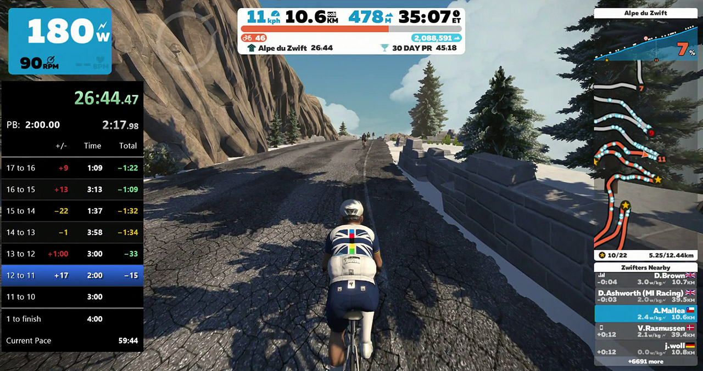
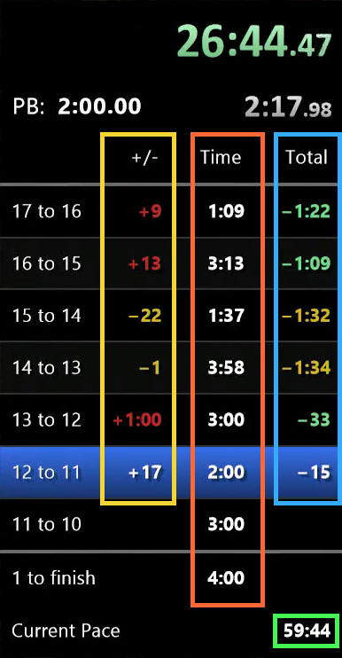

# Alpe splits reporter

This simple script reports the splits (or *segment times*) while riding your
bike up the [Alpe du Zwift](https://www.zwift.com/news/5753-climb-alpe-du-zwift)
to a [LiveSplit server](https://github.com/LiveSplit/LiveSplit.Server). In this
way, you can track your personal best times (or the times of other riders) and
have a live estimation of the time it will take you should you maintain your
pace.

## Requirements

* [Zwift](https://www.zwift.com/download) for Windows
* [LiveSplit]() with [LiveSplit
server](https://github.com/LiveSplit/LiveSplit.Server)
* [Python 3](https://www.python.org/downloads/windows/)
* The `alpe_split.py` script.

## LiveSplit configuration

### List of splits

You need to create a list of *splits* (or *segment times*) to load in LiveSplit,
so that the whole thing becomes meaningful. The splits are simply:

* Starting banner to hairpin 21
* Hairpin 21 to hairpin 20
* ...
* Hairpin 2 to hairpin 1
* Hairpin 1 to finish banner

A list of splits is saved in a file with extension `.lss`. You can download a
[list with the
names](https://raw.githubusercontent.com/janoma/alpe_split/main/Alpe_segments.lss)
so you don't have to type them all. Optionally, you can download a [list that
has some fake
segments](https://raw.githubusercontent.com/janoma/alpe_split/main/Alpe_one_hour.lss)
that make a total climb time of one hour.

### Layout

LiveSplit is quite customizable, and you can modify its layout to include
several times, partials or deltas. In the sample picture, the orange box
contains the time for each segment that you already passed, and the best segment
time for those you haven't passed yet. The yellow box contains the delta, or
difference, from the segment time in your current time with respect to the best
segment time. The green box contains the projected total time given the current
pace and assuming you'll keep doing the best times, while the blue box contains
the delta with respect to that projected time. If you keep the numbers in the
blue box negative, you're on your way to a new PB!

A [sample layout
file](https://raw.githubusercontent.com/janoma/alpe_split/main/LiveSplit_layout.lsl)
is provided with these settings.

## Running instructions

1. Start LiveSplit and load a list of 22 splits (or create your own).
1. Add LiveSplit Server to the layout.
1. Feel free to play with the *layout* settings so that it shows the list of
segments and a predicted total time. Optionally, load the provided layout file.
1. Start the server (secondary click on LiveSplit -> Control -> Start Server).
1. Open the Windows Command Prompt, go to the directory where you downloaded the
`alpe_split.py` script, and run `python3 alpe_split.py`.
1. Open Zwift and ride up the Alpe du Zwift (Road to Sky is the recommended route).

## Does it work?

If this works well for a few testers, I'll see about creating an executable file
so that users don't have to deal with the command line.
